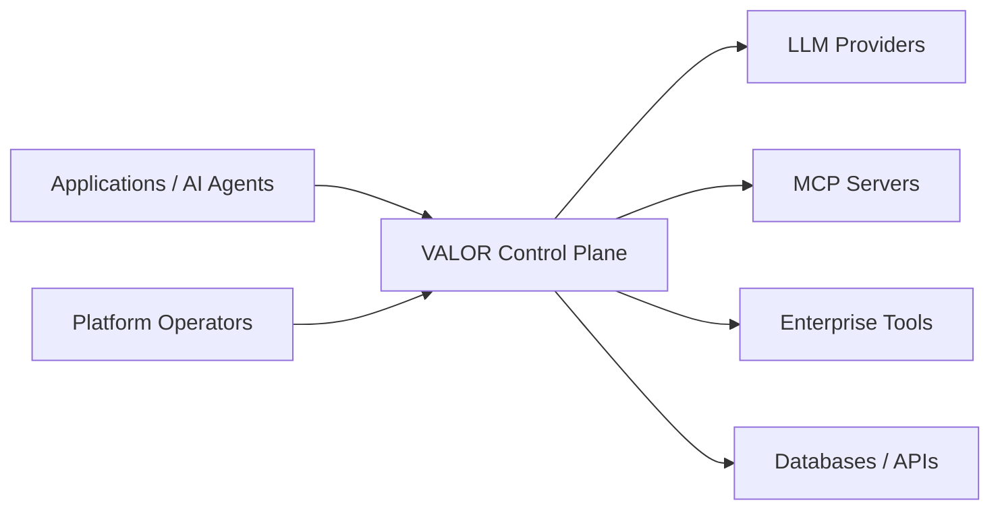
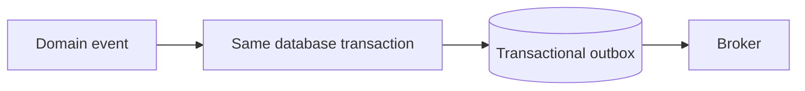

# Architecture

## System context



VALOR is the governance and evidence boundary between callers and AI/tool dependencies. Phase 0 implements only the operational shell.

## Phase 0 container and component view

```mermaid
flowchart TB
  C[HTTP Client] --> API[FastAPI presentation]
  API --> APP[Application ports]
  BOOT[Composition root] --> API
  BOOT --> INFRA[SQLAlchemy infrastructure]
  INFRA -. implements .-> APP
  INFRA --> PG[(PostgreSQL)]
  DOMAIN[Future context domain] <-- APP
```

The application is one deployable process. Operational routes are outside domain APIs. PostgreSQL is the only runtime dependency. The domain remains synchronous; async appears at I/O boundaries.

## Bounded-context map

| Context | Responsibility | Principal relationships |
|---|---|---|
| Identity & Tenancy | principals, tenant isolation, ownership | upstream identity source for every context |
| AI Asset Registry | agents, models, prompts, tools and versions | assets referenced by gateway, policy, evaluation |
| Runtime Gateway | invocation and provider/tool routing | emits facts to observability, policy and FinOps |
| Policy & Risk | authorization and risk decisions | evaluates runtime intent and asset metadata |
| Evaluation | offline/online quality evidence | gates asset and routing changes |
| Observability | traces, metrics and operational signals | consumes runtime facts; avoids owning business truth |
| FinOps | usage attribution, cost and budgets | consumes invocation usage per tenant/asset |
| Incident Management | detection and response lifecycle | consumes violations, SLOs and evaluation failures |
| Compliance & Audit | immutable decision evidence | consumes explicit integration events/contracts |

These are domain boundaries, not current packages or services. When implemented, each bounded context owns its `domain`, `application`, `infrastructure`, and `presentation` layers. Domain functionality must not accumulate indefinitely in global top-level application or infrastructure packages. Cross-context access will use published contracts or integration events rather than imports into another context's internals.

## Dependency and transaction rules

`presentation → application → domain`; infrastructure points inward by implementing application/domain ports. Domain and shared-kernel code cannot import FastAPI, Pydantic, SQLAlchemy, infrastructure, or presentation. Application cannot import presentation, SQLAlchemy, or concrete infrastructure. The architecture test resolves absolute and relative imports and enforces these rules recursively for architectural layers anywhere below `src/valor`; violations fail CI.

Commands own an explicit Unit of Work. Repositories persist aggregates but never commit. A handler explicitly commits after all invariants and writes succeed; exceptions roll back. Queries may use optimized read paths when justified and do not masquerade as aggregate repositories.

Domain failures contain domain language, never HTTP codes. Application failures remain protocol-independent. Presentation maps them to RFC 9457-style problem details. Unexpected failures do not disclose internal details.

## Events, CQRS, and evolution

Domain aggregates may record in-process domain events. Durable publication evolves only when required:



No broker is deployed in Phase 0. CQRS is selective: commands change state; separate query views appear only where read/write models materially differ. Global event sourcing is rejected; append-only event storage may later suit narrow audit workloads.

A module may be extracted only with evidence for independent scaling, failure or latency isolation, security isolation, distinct storage/workload characteristics, independent deployment cadence, or stable team ownership. Extraction requires an owned API/event contract, data ownership, observability, failure semantics, and migration plan. Microservices are an option, not a destination.

## Logging and sensitive data

Logs are structured and prepared for request/correlation context through `structlog.contextvars`. Log allow-listed identifiers, decision outcomes, timing, and safe error classes. Never log API keys, tokens, passwords, connection strings, raw prompts/responses, tool arguments/results, personal data, or credentials. Redaction must occur before the logger boundary; production transports and retention policies are deferred.
