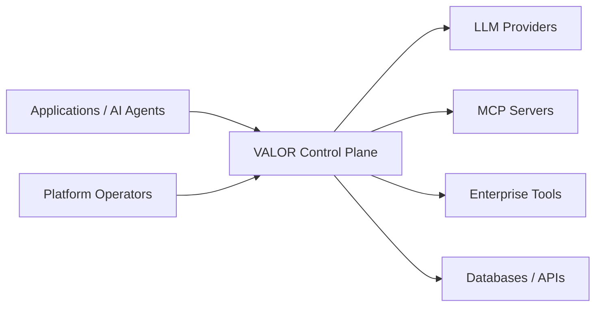
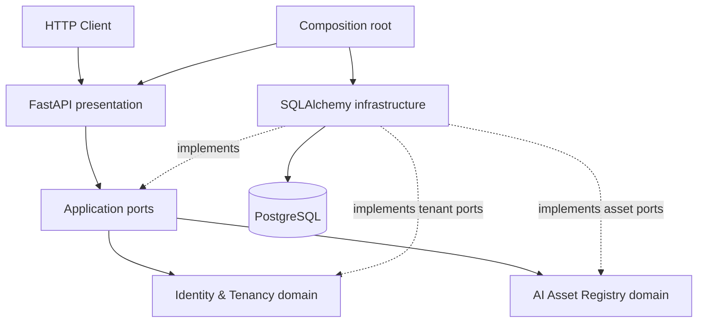
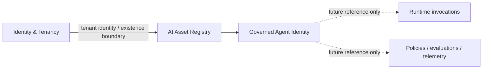
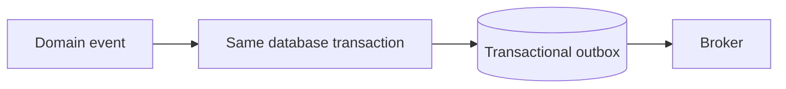

# Architecture

## System context

VALOR is the governance and evidence boundary between callers and AI/tool dependencies. Phase 0 established the operational shell; Phase 1 currently implements Tenant create/get plus governed Agent and Model reference register/get slices.

## Current container and component view

The application is one deployable process. Operational routes are outside domain APIs. PostgreSQL is the only runtime dependency. The domain remains synchronous; async appears at I/O boundaries.

## Bounded-context map

| Context | Responsibility | Principal relationships |
|---|---|---|
| Identity & Tenancy | principals, tenant isolation, ownership | upstream identity source for every context |
| AI Asset Registry | agents, models, prompts, tools and versions | assets referenced by gateway, policy, evaluation |
| Runtime Gateway | invocation and provider/tool routing | emits facts to observability, policy and FinOps |
| Policy & Risk | authorization and risk decisions | evaluates runtime intent and asset metadata |
| Evaluation | offline/online quality evidence | gates asset and routing changes |
| Observability | traces, metrics and operational signals | consumes runtime facts; avoids owning business truth |
| FinOps | usage attribution, cost and budgets | consumes invocation usage per tenant/asset |
| Incident Management | detection and response lifecycle | consumes violations, SLOs and evaluation failures |
| Compliance & Audit | immutable decision evidence | consumes explicit integration events/contracts |

These are domain boundaries, not services. Identity & Tenancy currently supports Tenant creation and retrieval. AI Asset Registry currently supports Agent and governed Model reference registration and retrieval. Each bounded context owns its `domain`, `application`, `infrastructure`, and `presentation` layers. Domain functionality must not accumulate indefinitely in global top-level application or infrastructure packages. Cross-context access uses explicit contracts rather than imports into another context's internals.

### Tenant slice decisions

Tenant identity is an application-generated UUID and does not depend on persistence. A tenant name is trimmed, internal whitespace is collapsed, and the canonical value is limited to 100 characters. Names are globally unique for this slice under a case-folded canonical comparison; PostgreSQL enforces the normalized key so concurrent requests cannot bypass uniqueness. This global rule can be revisited only if a future, explicit tenancy hierarchy changes the domain meaning.

The implemented endpoints have no authentication or authorization. They are an architecture proof and must not be exposed to untrusted networks.

### Agent registry and tenant boundary

An AI Asset Registry Agent is a governed workload identity known to VALOR. It contains no executable agent code, model configuration, prompts, tools, credentials, or runtime behavior. Future Runtime Gateway requests may reference `tenant_id` and `agent_id`; the registry does not execute them.

AI Asset Registry represents ownership with its local `OwningTenantId` value object. Its application layer asks only `TenantExistencePort.exists()`. The PostgreSQL adapter reads the published persistence identity `tenants.id` without importing the Tenant aggregate, repository, or ORM model. Registration checks existence for a clear error before opening the Agent write Unit of Work. The `agents.tenant_id` foreign key remains authoritative if state changes between the check and flush; that violation maps to the same `OwningTenantNotFound` application failure.

Agent names use the same intentionally small canonicalization policy independently: trim/collapse whitespace, a 100-character canonical limit, and `casefold()` for comparison. The database composite constraint makes normalized names unique within an owning tenant, while allowing the same name in different tenants.

### Model registry decisions

A governed Model is a tenant-owned VALOR identity referencing an external provider model. It records `ModelId`, local ownership, a governance name, an explicit provider value, the opaque provider model reference, and registration time. It is not a provider client or runtime configuration: no credentials are stored, no provider connection is attempted, and registration does not prove the provider-side reference exists. Agents and Models are intentionally not linked in this slice.

Model names are trimmed, internal whitespace is collapsed, and the canonical value is limited to 100 characters. PostgreSQL enforces case-folded normalized-name uniqueness within each tenant. The same provider and provider-model reference may appear in multiple governed Model records because the VALOR name, rather than an external identifier, defines this slice's governance identity.

`Provider` is a Python string enum stored in a 50-character varchar. This gives API callers an explicit supported vocabulary while avoiding a PostgreSQL enum migration whenever that vocabulary grows. Provider model references are treated as opaque trimmed strings of at most 255 characters; provider-specific syntax and live validation are deferred until an actual provider-integration use case exists.

Model registration reuses the AI Asset Registry's `TenantExistencePort` and local `OwningTenantId`. A pre-check produces a useful error, while the `models.tenant_id` foreign key remains authoritative under races. Model persistence has its own repository and Unit of Work surface; no generic AI-asset repository or service hierarchy was introduced.

## Dependency and transaction rules

`presentation → application → domain`; infrastructure points inward by implementing application/domain ports. Domain and shared-kernel code cannot import FastAPI, Pydantic, SQLAlchemy, infrastructure, or presentation. Application cannot import presentation, SQLAlchemy, or concrete infrastructure. The architecture test resolves absolute and relative imports and enforces these rules recursively for architectural layers anywhere below `src/valor`; violations fail CI.

Commands own an explicit Unit of Work. Repositories persist aggregates but never commit. A handler explicitly commits after all invariants and writes succeed; exceptions roll back. Queries may use optimized read paths when justified and do not masquerade as aggregate repositories.

Domain failures contain domain language, never HTTP codes. Application failures remain protocol-independent. Presentation maps them to RFC 9457-style problem details. Unexpected failures do not disclose internal details.

## Events, CQRS, and evolution

Domain aggregates may record in-process domain events. Durable publication evolves only when required:

No broker is deployed. CQRS is selective: commands change state; separate query views appear only where read/write models materially differ. Global event sourcing is rejected; append-only event storage may later suit narrow audit workloads.

A module may be extracted only with evidence for independent scaling, failure or latency isolation, security isolation, distinct storage/workload characteristics, independent deployment cadence, or stable team ownership. Extraction requires an owned API/event contract, data ownership, observability, failure semantics, and migration plan. Microservices are an option, not a destination.

## Logging and sensitive data

Logs are structured and prepared for request/correlation context through `structlog.contextvars`. Log allow-listed identifiers, decision outcomes, timing, and safe error classes. Never log API keys, tokens, passwords, connection strings, raw prompts/responses, tool arguments/results, personal data, or credentials. Redaction must occur before the logger boundary; production transports and retention policies are deferred.
