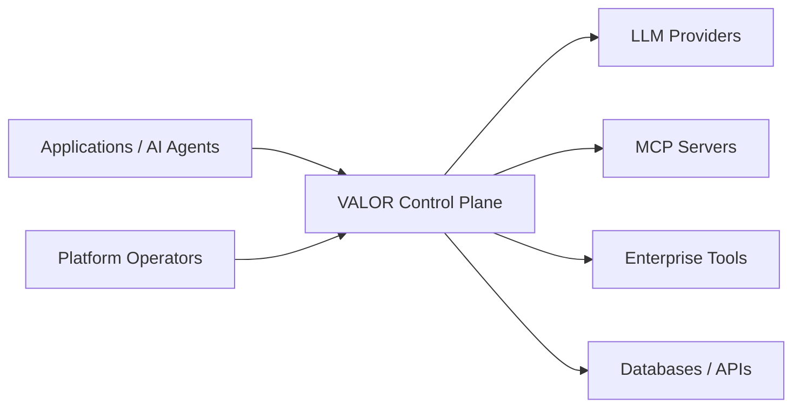
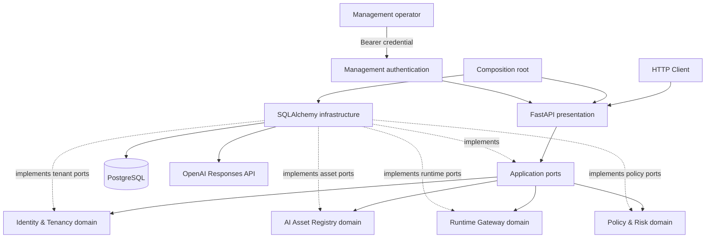
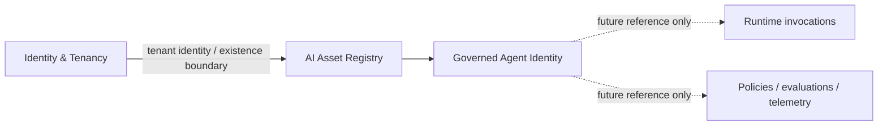
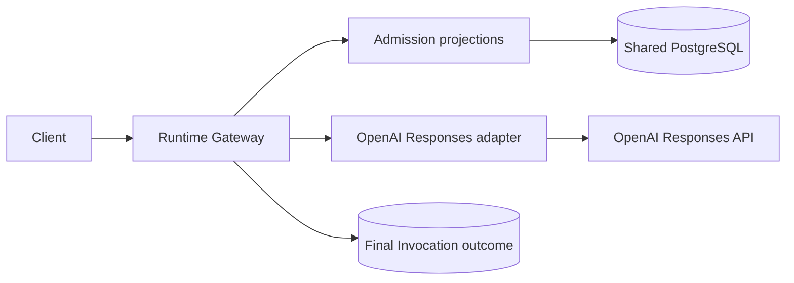
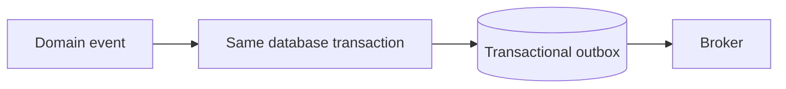

# Architecture

## System context

VALOR is the governance and evidence boundary between callers and AI/tool dependencies. Phase 0 established the operational shell; Phase 1 added Tenant, Agent, and governed Model reference slices. Phase 2 has one synchronous OpenAI path governed by explicit default-deny Agent-to-Model permission decisions, with interim bearer authentication around management APIs; it is neither a complete gateway nor a general policy or identity platform.

## Current container and component view

The application is one deployable process. Operational routes are outside domain APIs. PostgreSQL is the only runtime dependency. The domain remains synchronous; async appears at I/O boundaries.

## Bounded-context map

| Context | Responsibility | Principal relationships |
|---|---|---|
| Identity & Tenancy | principals, tenant isolation, ownership | upstream identity source for every context |
| AI Asset Registry | agents, models, prompts, tools and versions | assets referenced by gateway, policy, evaluation |
| Runtime Gateway | invocation and provider/tool routing | emits facts to observability, policy and FinOps |
| Policy & Risk | authorization and risk decisions | evaluates runtime intent and asset metadata |
| Evaluation | offline/online quality evidence | gates asset and routing changes |
| Observability | traces, metrics and operational signals | consumes runtime facts; avoids owning business truth |
| FinOps | usage attribution, cost and budgets | consumes invocation usage per tenant/asset |
| Incident Management | detection and response lifecycle | consumes violations, SLOs and evaluation failures |
| Compliance & Audit | immutable decision evidence | consumes explicit integration events/contracts |

These are domain boundaries, not services. Identity & Tenancy supports Tenant creation/retrieval; AI Asset Registry supports Agent and Model registration/retrieval; Runtime Gateway supports one synchronous OpenAI Invocation; Policy & Risk supports one exact Agent-to-Model permission and decision history. Each context owns its architectural layers. Cross-context access uses explicit contracts rather than imports into another context's internals.

### Tenant slice decisions

Tenant identity is an application-generated UUID and does not depend on persistence. A tenant name is trimmed, internal whitespace is collapsed, and the canonical value is limited to 100 characters. Names are globally unique for this slice under a case-folded canonical comparison; PostgreSQL enforces the normalized key so concurrent requests cannot bypass uniqueness. This global rule can be revisited only if a future, explicit tenancy hierarchy changes the domain meaning.

The implemented endpoints have no authentication or authorization. They are an architecture proof and must not be exposed to untrusted networks.

### Agent registry and tenant boundary

An AI Asset Registry Agent is a governed workload identity known to VALOR. It contains no executable agent code, model configuration, prompts, tools, credentials, or runtime behavior. Future Runtime Gateway requests may reference `tenant_id` and `agent_id`; the registry does not execute them.

AI Asset Registry represents ownership with its local `OwningTenantId` value object. Its application layer asks only `TenantExistencePort.exists()`. The PostgreSQL adapter reads the published persistence identity `tenants.id` without importing the Tenant aggregate, repository, or ORM model. Registration checks existence for a clear error before opening the Agent write Unit of Work. The `agents.tenant_id` foreign key remains authoritative if state changes between the check and flush; that violation maps to the same `OwningTenantNotFound` application failure.

Agent names use the same intentionally small canonicalization policy independently: trim/collapse whitespace, a 100-character canonical limit, and `casefold()` for comparison. The database composite constraint makes normalized names unique within an owning tenant, while allowing the same name in different tenants.

### Model registry decisions

A governed Model is a tenant-owned VALOR identity referencing an external provider model. It records `ModelId`, local ownership, a governance name, an explicit provider value, the opaque provider model reference, and registration time. It is not a provider client or runtime configuration: no credentials are stored, no provider connection is attempted, and registration does not prove the provider-side reference exists. Agents and Models are intentionally not linked in this slice.

Model names are trimmed, internal whitespace is collapsed, and the canonical value is limited to 100 characters. PostgreSQL enforces case-folded normalized-name uniqueness within each tenant. The same provider and provider-model reference may appear in multiple governed Model records because the VALOR name, rather than an external identifier, defines this slice's governance identity.

`Provider` is a Python string enum stored in a 50-character varchar. This gives API callers an explicit supported vocabulary while avoiding a PostgreSQL enum migration whenever that vocabulary grows. Provider model references are treated as opaque trimmed strings of at most 255 characters; provider-specific syntax and live validation are deferred until an actual provider-integration use case exists.

Model registration reuses the AI Asset Registry's `TenantExistencePort` and local `OwningTenantId`. A pre-check produces a useful error, while the `models.tenant_id` foreign key remains authoritative under races. Model persistence has its own repository and Unit of Work surface; no generic AI-asset repository or service hierarchy was introduced.

### First Runtime Gateway slice

An Invocation is a VALOR-owned UUID plus Tenant, Agent, and Model IDs, final `succeeded` or `failed` status, text input, optional successful output, and timezone-aware start/completion timestamps. It does not use an upstream request ID as identity and has no token, cost, retry, tracing, policy, tool, or evaluation fields.

Runtime admission uses local identity/projection types and three narrow application ports. A PostgreSQL adapter queries only the published fields required from `tenants`, `agents`, and `models`; Runtime Gateway domain/application code imports no owning-context aggregates, repositories, ORM rows, or infrastructure. This is deliberate shared-schema coupling in the modular monolith. PostgreSQL foreign keys from `invocations` to all three records provide final referential protection without ORM relationships.

The request supplies `ModelId` directly. Any Model belonging to the same Tenant is currently admissible; no Agent-to-Model assignment or implicit default has been invented. Missing resources and cross-tenant ownership mismatches use the same non-disclosing HTTP response. Only the `openai` provider is executable; other registered providers remain valid governance records but runtime rejects them explicitly.

The OpenAI infrastructure adapter uses the current Responses API for one plain string input and reads provider-neutral `output_text`. It requests `store=false`, uses an environment-supplied credential and bounded timeout, and translates SDK/upstream failures without exposing raw details. SDK types do not cross the infrastructure boundary.

Admission reads occur before policy evaluation. After resource ownership succeeds, Runtime Gateway creates InvocationId and asks its narrow policy-decision port. Policy & Risk atomically resolves the current permission, persists the decision, and commits before any provider call. Default or explicit DENY then creates a linked denied Invocation and returns 403 without contacting the provider. Explicit ALLOW permits provider execution, after which a short Invocation Unit of Work persists success or failure. No database transaction spans provider I/O and no distributed transaction is attempted.

This first slice persists raw input and successful output for retrieval/audit value but never logs them. The runtime API is unauthenticated. Retention, redaction, classification, encryption policy, and production access controls are explicit technical debt, and the endpoints must not be exposed to untrusted networks.

### Default-deny Agent-to-Model admission

Policy & Risk owns one `AgentModelPermission` per Tenant/Agent/Model tuple. PUT atomically creates or replaces the current `ALLOW`/`DENY` effect while preserving PermissionId and creation time. There are no conditions, wildcards, inheritance, rule precedence, versions, assignments, RBAC/ABAC, or external policy engine.

Each evaluated attempt creates a PolicyDecision with DecisionId, InvocationId, exact resource IDs, effect, timestamp, and optional PermissionId. A null PermissionId with DENY means default deny; a present PermissionId identifies explicit allow or deny. `invocations.policy_decision_id` links the runtime result back to that fact. The reverse Decision `invocation_id` is a unique indexed correlation value rather than a foreign key because the decision must commit before the provider call and before the final Invocation row exists.

The permission-management application independently validates Tenant existence and Agent/Model ownership using Policy-local ports/projections. Its shared-database adapter imports no owning-context aggregate or ORM row, and foreign keys remain authoritative against races. Runtime Gateway imports no Policy & Risk internals; a Policy infrastructure adapter implements the Runtime-owned decision port at composition time.

Default deny materially improves runtime safety. Policy management requires the configured management bearer credential and exact configured Tenant scope, so neither an anonymous caller nor a management principal outside the Tenant can grant ALLOW. Runtime-client authentication remains unresolved. See ADR-0009, ADR-0010, and ADR-0011.

### Management authentication boundary

Tenant, Agent, Model, and Policy routes are management-plane APIs and share one FastAPI authentication dependency. It validates an environment-supplied bearer credential in constant time and produces a framework-independent `AuthenticatedPrincipal` containing the stable configured principal ID, `management` kind, and a finite immutable set of manageable Tenant UUIDs. Missing or invalid credentials receive the same sanitized 401 Problem Details response and `WWW-Authenticate: Bearer`.

The credential is a `SecretStr`, is unwrapped only during validation, and is never an audit identity, persistence value, response field, or logging field. Authentication proves possession; a separate framework-independent rule authorizes exact Tenant UUID membership. Empty scope grants nothing, malformed or missing scope fails startup, and no wildcard/global authority exists.

Tenant GET authorizes its path identity before loading. Agent, Model, and Permission creation/mutation authorizes the supplied Tenant before business work; retrieval authorizes the aggregate's owning Tenant before presentation. Denials reuse each resource's existing 404 response, preventing cross-Tenant enumeration. Tenant creation alone remains an authenticated provisioning exception: it creates no grant, so configuration and application restart are required before the generated Tenant can be managed.

Health endpoints remain public for infrastructure probes. Runtime endpoints remain separate and currently unauthenticated; neither the management credential nor its Tenant scopes are interpreted as an Agent or runtime-client identity. Provider credentials remain server-side environment secrets. The planned security evolution is configured scopes → multiple authenticated principals → persisted Tenant grants → role semantics if justified → OIDC/enterprise identity integration.

## Dependency and transaction rules

`presentation → application → domain`; infrastructure points inward by implementing application/domain ports. Domain and shared-kernel code cannot import FastAPI, Pydantic, SQLAlchemy, infrastructure, or presentation. Application cannot import presentation, SQLAlchemy, or concrete infrastructure. The architecture test resolves absolute and relative imports and enforces these rules recursively for architectural layers anywhere below `src/valor`; violations fail CI.

Commands own an explicit Unit of Work. Repositories persist aggregates but never commit. A handler explicitly commits after all invariants and writes succeed; exceptions roll back. Queries may use optimized read paths when justified and do not masquerade as aggregate repositories.

Domain failures contain domain language, never HTTP codes. Application failures remain protocol-independent. Presentation maps them to RFC 9457-style problem details. Unexpected failures do not disclose internal details.

## Events, CQRS, and evolution

Domain aggregates may record in-process domain events. Durable publication evolves only when required:

No broker is deployed. CQRS is selective: commands change state; separate query views appear only where read/write models materially differ. Global event sourcing is rejected; append-only event storage may later suit narrow audit workloads.

A module may be extracted only with evidence for independent scaling, failure or latency isolation, security isolation, distinct storage/workload characteristics, independent deployment cadence, or stable team ownership. Extraction requires an owned API/event contract, data ownership, observability, failure semantics, and migration plan. Microservices are an option, not a destination.

## Logging and sensitive data

Logs are structured and prepared for request/correlation context through `structlog.contextvars`. Log allow-listed identifiers, decision outcomes, timing, and safe error classes. Never log API keys, tokens, passwords, connection strings, raw prompts/responses, tool arguments/results, personal data, or credentials. Redaction must occur before the logger boundary; production transports and retention policies are deferred.
