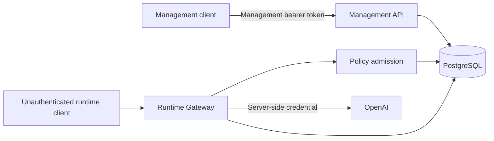

# Initial threat model

**Status:** Initial, living document
**Scope:** Implemented VALOR management plane, Runtime Gateway, Policy & Risk, PostgreSQL,
and OpenAI provider boundary through Phase 2.3

This document describes current trust boundaries and risks. Planned controls are not described as
implemented. Revisit it whenever identity, data retention, provider routing, or deployment
boundaries materially change.

## System and assets



The primary assets are:

- governance configuration: Tenants, Agents, Models, and Agent-to-Model permissions;
- provider credentials, which grant external access and can create financial cost;
- Invocation input/output, identity references, status, and timestamps;
- PolicyDecision evidence connecting an attempted Invocation to ALLOW or DENY;
- management principal identity, bearer credential, and configured Tenant scopes.

Invocation input and output can contain customer data, personal information, confidential data,
regulated data, or credentials accidentally placed in prompts. They are high-value assets even
though the current model treats them as plain text.

## Security assumptions

- Deployment provides TLS and protects traffic before it reaches FastAPI.
- Environment variables and database credentials are injected through a trusted deployment path.
- PostgreSQL and its administrative access are not exposed to untrusted clients.
- Host, container runtime, dependency, and CI compromise are outside the application's current
  controls but can invalidate every trust boundary below.
- Runtime endpoints must not be exposed to untrusted networks in the current phase.

## Trust boundaries

### Management client to management API

Implemented controls:

- constant-time validation of a static management bearer credential;
- one stable, non-secret management principal identity;
- explicit finite Tenant UUID scopes with empty scope failing closed;
- non-disclosing 404 responses for cross-Tenant resources;
- exact Tenant ownership enforcement for Agent, Model, and Policy management.

Tenant creation is an authenticated provisioning exception. It does not automatically grant scope.

Residual threats include bearer theft and replay, one shared principal, lack of credential rotation,
lack of individual accountability, and lack of a policy-change audit trail.

### Runtime client to Runtime Gateway

This is the largest open boundary. Runtime requests currently supply Tenant and Agent IDs without
proving that the caller owns either identity. A reachable attacker could claim an Agent with an
existing ALLOW permission and invoke its Model.

Policy evaluation may be logically correct while operating on an untrusted identity claim:

```text
unauthenticated caller → claims Agent A → Agent A is allowed → provider executes
```

The same boundary affects `GET /api/v1/runtime/invocations/{invocation_id}`. A caller that learns an
Invocation UUID may retrieve stored input/output without proving Tenant, Agent, or originating
principal identity.

### Runtime Gateway to provider

Implemented controls:

- provider credentials remain server-side environment secrets;
- the OpenAI SDK is isolated in infrastructure;
- provider calls occur only after ownership admission and an explicit policy ALLOW;
- provider errors are sanitized;
- provider timeout is bounded;
- the OpenAI request sets `store=false`.

Residual threats include credential theft, provider outage, malicious output, latency, unbounded
usage, and cost abuse. VALOR persists its provider-neutral output text, though it does not persist a
raw SDK response object.

### Application to PostgreSQL

PostgreSQL constraints protect ownership foreign keys, unique identities, permission tuples, and
Invocation/Decision relationships. Explicit Units of Work own commit and rollback.

Residual threats include application defects, compromised database credentials, direct database
mutation, audit-record tampering, backup disclosure, and plaintext application-level storage of
Invocation input/output.

### Policy configuration to runtime enforcement

Management authentication and Tenant authorization prevent anonymous or cross-Tenant policy
mutation. Runtime admission remains default-deny: absence of permission and explicit DENY prevent
provider execution.

Residual threats include a stolen authorized credential, repudiation because permission changes
have no durable management actor record, and lack of permission history or approval workflow.

## STRIDE-oriented threat register

| Category | Threat | Current control | Residual severity | Next control |
|---|---|---|---|---|
| Spoofing | Caller claims another Agent/Tenant at runtime | Ownership and policy validate claims, not caller identity | Critical/High | Separate runtime principal authentication |
| Spoofing | Management principal impersonation | Static bearer authentication, constant-time comparison | High | Rotation and multiple federated principals |
| Tampering | Unauthorized policy mutation | Management auth, exact Tenant scope, DB constraints | Medium | Management mutation audit/history |
| Tampering | Direct Invocation/Decision changes | DB access boundary and constraints | High if DB compromised | Restricted DB roles and tamper-evident evidence |
| Repudiation | Operator denies changing a permission | Stable principal exists only in request boundary | Medium | Persist management action evidence |
| Information disclosure | Runtime GET reveals prompt/response | UUID lookup and sanitized errors only | High | Runtime identity and invocation read authorization |
| Information disclosure | Database/backup reveals prompt/response | Infrastructure access boundary | High/Medium | Retention, redaction, classification, encryption policy |
| Denial of service | Runtime exhausts connections/provider capacity | Provider timeout | High/Medium | Identity-aware limits and concurrency controls |
| Cost abuse | Unauthorized provider traffic incurs spend | Default-deny model policy | High while caller identity is untrusted | Runtime authentication, then quotas/budgets |
| Elevation of privilege | Caller claims a more privileged Agent | No effective caller-to-Agent binding | Critical/High | Credential bound to exactly one Tenant/Agent |

## Highest-priority attack scenario

Assume Agent A may use Model X while Agent B may not. An unauthenticated caller can submit Agent A's
ID. VALOR validates that Agent A belongs to the Tenant and has ALLOW, but cannot establish that the
caller is Agent A. This is an identity-spoofing path through an otherwise correct authorization
decision and can cause data disclosure and direct provider cost.

The next security slice should solve only this foundation: establish a runtime credential separate
from the management credential, bind it to exactly one Tenant and Agent, reject mismatched claims,
retain independent Agent-to-Model policy evaluation, and isolate Invocation reads by authenticated
runtime principal.

## Current posture

Implemented strengths:

- management authentication and explicit Tenant-scoped authorization;
- Tenant ownership and non-disclosing cross-Tenant management failures;
- default-deny Agent-to-Model runtime admission;
- persisted PolicyDecision and Invocation records;
- provider-secret isolation and sanitized upstream failures;
- PostgreSQL integrity constraints and explicit transactions.

Material gaps:

1. Runtime client authentication and caller-to-Agent binding — Critical/High.
2. Runtime Invocation read authorization — High.
3. Sensitive Invocation data retention/redaction policy — High/Medium.
4. Individual management accountability and policy-change audit — Medium.
5. Credential rotation — Medium.
6. Identity-aware rate, concurrency, and budget controls — Medium.

## Recommended sequence

```text
Runtime principal authentication
  → Runtime Tenant/Agent claim binding
  → Invocation read isolation
  → Usage metadata and observability
  → Per-principal rate/budget controls
  → Sensitive-data retention and redaction
  → Management mutation audit
  → Enterprise identity/OIDC when justified
```

The next slice should not introduce an OAuth server, OIDC federation, RBAC, OPA, Vault, mTLS,
rate-limiting platform, WAF, SIEM, or generalized encryption framework. Those controls require
separate evidence and design decisions.
