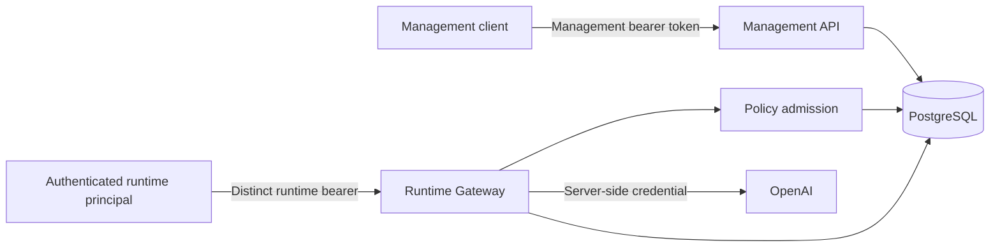

# Initial threat model

**Status:** Initial, living document
**Scope:** Implemented VALOR management plane, Runtime Gateway, Policy & Risk, PostgreSQL,
and OpenAI provider boundary through Phase 3.3

This document describes current trust boundaries and risks. Planned controls are not described as
implemented. Revisit it whenever identity, data retention, provider routing, or deployment
boundaries materially change.

## System and assets



The primary assets are:

- governance configuration: Tenants, Agents, Models, and Agent-to-Model permissions;
- provider credentials, which grant external access and can create financial cost;
- Invocation input/output, identity references, status, timestamps, duration, normalized usage,
  and safe provider response correlation;
- PolicyDecision evidence connecting an attempted Invocation to ALLOW or DENY;
- management principal identity, bearer credential, and configured Tenant scopes.

Invocation input and output can contain customer data, personal information, confidential data,
regulated data, or credentials accidentally placed in prompts. They are high-value assets even
though the current model treats them as plain text.

## Security assumptions

- Deployment provides TLS and protects traffic before it reaches FastAPI.
- Environment variables and database credentials are injected through a trusted deployment path.
- PostgreSQL and its administrative access are not exposed to untrusted clients.
- Host, container runtime, dependency, and CI compromise are outside the application's current
  controls but can invalidate every trust boundary below.
- Static runtime credentials require TLS and secure injection; they have no rotation or revocation.

## Trust boundaries

### Management client to management API

Implemented controls:

- constant-time validation of a static management bearer credential;
- one stable, non-secret management principal identity;
- explicit finite Tenant UUID scopes with empty scope failing closed;
- non-disclosing 404 responses for cross-Tenant resources;
- exact Tenant ownership enforcement for Agent, Model, and Policy management.

Tenant creation is an authenticated provisioning exception. It does not automatically grant scope.

Residual threats include bearer theft and replay, one shared principal, lack of credential rotation,
lack of individual accountability, and lack of a policy-change audit trail.

### Runtime client to Runtime Gateway

Runtime routes now require a credential from a separate configuration-backed trust domain. Each
credential resolves to exactly one Tenant and Agent; POST accepts no caller-controlled Tenant or
Agent claims. GET requires exact runtime principal, Tenant, and Agent correlation. This mitigates
the original Agent-spoofing and known-Invocation-ID disclosure paths.

Residual risks remain significant: credentials are static and replayable, have no expiry,
rotation, dynamic revocation, issuance workflow, rate limit, or workload-attestation mechanism.

### Runtime Gateway to provider

Implemented controls:

- provider credentials remain server-side environment secrets;
- the OpenAI SDK is isolated in infrastructure;
- provider calls occur only after ownership admission and an explicit policy ALLOW;
- provider errors are sanitized;
- provider timeout is bounded;
- the OpenAI request sets `store=false`.
- provider usage and response identity are allow-listed and normalized before persistence;
- raw SDK responses, arbitrary metadata, headers, credentials, and provider errors are not persisted.
- policy-allowed provider execution is guarded by a fail-closed UTC-daily Runtime Principal
  total-unit pre-check using persisted known usage.
- complete usage can be translated into an immutable Invocation-level estimated USD snapshot when
  matching static pricing is configured.

Residual threats include credential theft, provider outage, malicious output, latency, concurrent
usage-limit overshoot, unknown consumption when provider telemetry is absent, and cost abuse. The
sequential per-principal limit improves basic containment, but there are no request-rate limits,
tenant budgets, automatic credential revocation, alerting, or monetary enforcement.

Configured pricing improves deterministic attribution but is not invoice-reconciled. Missing usage
or pricing prevents attribution, and there is no monetary budget, cost-based blocking, provider
price synchronization, aggregate tenant budget, or managed pricing history outside Invocation
snapshots.

Tenant-scoped Runtime reports let authorized Management operators inspect aggregate status, known
usage, and estimated cost without retrieving individual prompts or outputs. Existing non-disclosing
Tenant authorization prevents UUID knowledge from exposing another Tenant's aggregates, and the
required 31-day maximum range limits accidental broad scans. Residual risk remains: completeness
depends on provider telemetry and pricing attribution, estimates are not invoice truth, raw
Invocation retention still exists, there is no report audit trail or budget enforcement, and static
Management credentials remain broad within their configured Tenant set.

Fixed Top 10 Agent and Model cost rankings let authorized operators identify which governed asset
identities drive estimated cost without inspecting Invocation content. Rows contain only IDs and
aggregates and remain inside the same Tenant/time filter. IDs require external authorized context
to interpret, visibility is intentionally limited to ten identities per dimension, missing
telemetry affects completeness, and reporting still has no access audit trail or budget enforcement.

### Application to PostgreSQL

PostgreSQL constraints protect ownership foreign keys, unique identities, permission tuples, and
Invocation/Decision relationships. Explicit Units of Work own commit and rollback.

Residual threats include application defects, compromised database credentials, direct database
mutation, audit-record tampering, backup disclosure, and plaintext application-level storage of
Invocation input/output.

### Policy configuration to runtime enforcement

Management authentication and Tenant authorization prevent anonymous or cross-Tenant policy
mutation. Runtime admission remains default-deny: absence of permission and explicit DENY prevent
provider execution.

Residual threats include a stolen authorized credential, repudiation because permission changes
have no durable management actor record, and lack of permission history or approval workflow.

## STRIDE-oriented threat register

| Category | Threat | Current control | Residual severity | Next control |
|---|---|---|---|---|
| Spoofing | Caller claims another Agent/Tenant at runtime | Identity derives from a credential bound to one Tenant/Agent | Mitigated; credential theft remains High | Rotation/revocation and workload identity |
| Spoofing | Management principal impersonation | Static bearer authentication, constant-time comparison | High | Rotation and multiple federated principals |
| Tampering | Unauthorized policy mutation | Management auth, exact Tenant scope, DB constraints | Medium | Management mutation audit/history |
| Tampering | Direct Invocation/Decision changes | DB access boundary and constraints | High if DB compromised | Restricted DB roles and tamper-evident evidence |
| Repudiation | Operator denies changing a permission | Stable principal exists only in request boundary | Medium | Persist management action evidence |
| Information disclosure | Cross-principal Runtime GET reveals prompt/response | Exact principal/Tenant/Agent correlation and non-disclosing 404 | Mitigated; stored-data risk remains High/Medium | Retention, redaction, encryption policy |
| Information disclosure | Database/backup reveals prompt/response | Infrastructure access boundary | High/Medium | Retention, redaction, classification, encryption policy |
| Denial of service | Runtime exhausts connections/provider capacity | Provider timeout | High/Medium | Identity-aware limits and concurrency controls |
| Cost abuse | Stolen runtime credential incurs provider spend | Authentication, default-deny policy, sequential UTC-daily usage pre-check | Medium; concurrent/unknown usage remains | Rotation, reservations, rate limits, tenant budgets |
| Repudiation | Provider execution cannot be correlated during support investigation | Safe provider response ID persisted when available | Medium/Low | Managed tracing and retention policy |
| Elevation of privilege | Caller claims a more privileged Agent | Request identity removed; credential binds exact Tenant/Agent | Mitigated; stolen credential remains High | Managed workload identity lifecycle |

## Highest-priority attack scenario

Before Phase 2.4, if Agent A could use Model X while Agent B could not, an unauthenticated caller
could submit Agent A's ID. VALOR validated that Agent A belonged to the Tenant and had ALLOW, but
could not establish that the caller was Agent A. This was an identity-spoofing path through an
otherwise correct authorization decision that could cause data disclosure and direct provider cost.

Phase 2.4 mitigates this scenario with a distinct Runtime Principal, removal of caller-controlled
Tenant/Agent fields, independent policy enforcement, and principal-isolated reads. Static
credential theft/replay now replaces unauthenticated identity claims as the principal residual
runtime identity risk.

## Current posture

Implemented strengths:

- management authentication and explicit Tenant-scoped authorization;
- separate Runtime authentication bound to an exact Tenant and Agent;
- non-disclosing Runtime read isolation by principal, Tenant, and Agent;
- Tenant ownership and non-disclosing cross-Tenant management failures;
- default-deny Agent-to-Model runtime admission;
- persisted PolicyDecision and Invocation records;
- persisted duration, normalized usage attribution, and safe provider response correlation;
- provider-secret isolation and sanitized upstream failures;
- PostgreSQL integrity constraints and explicit transactions.

Material gaps:

1. Static runtime credential lifecycle, theft, replay, rotation, and revocation — High.
2. Sensitive Invocation data retention/redaction policy — High/Medium.
3. Concurrency-safe reservations, request-rate limits, and tenant budgets — Medium.
4. Individual management accountability and policy-change audit — Medium.

## Recommended sequence

```text
Managed runtime credential issuance/rotation/revocation
  → Per-principal rate/budget controls using persisted usage facts
  → Sensitive-data retention and redaction
  → Management mutation audit
  → Enterprise identity/OIDC when justified
```

The next slice should not introduce an OAuth server, OIDC federation, RBAC, OPA, Vault, mTLS,
rate-limiting platform, WAF, SIEM, or generalized encryption framework. Those controls require
separate evidence and design decisions.
